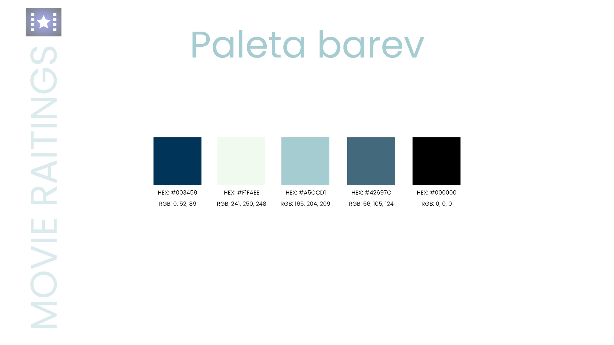
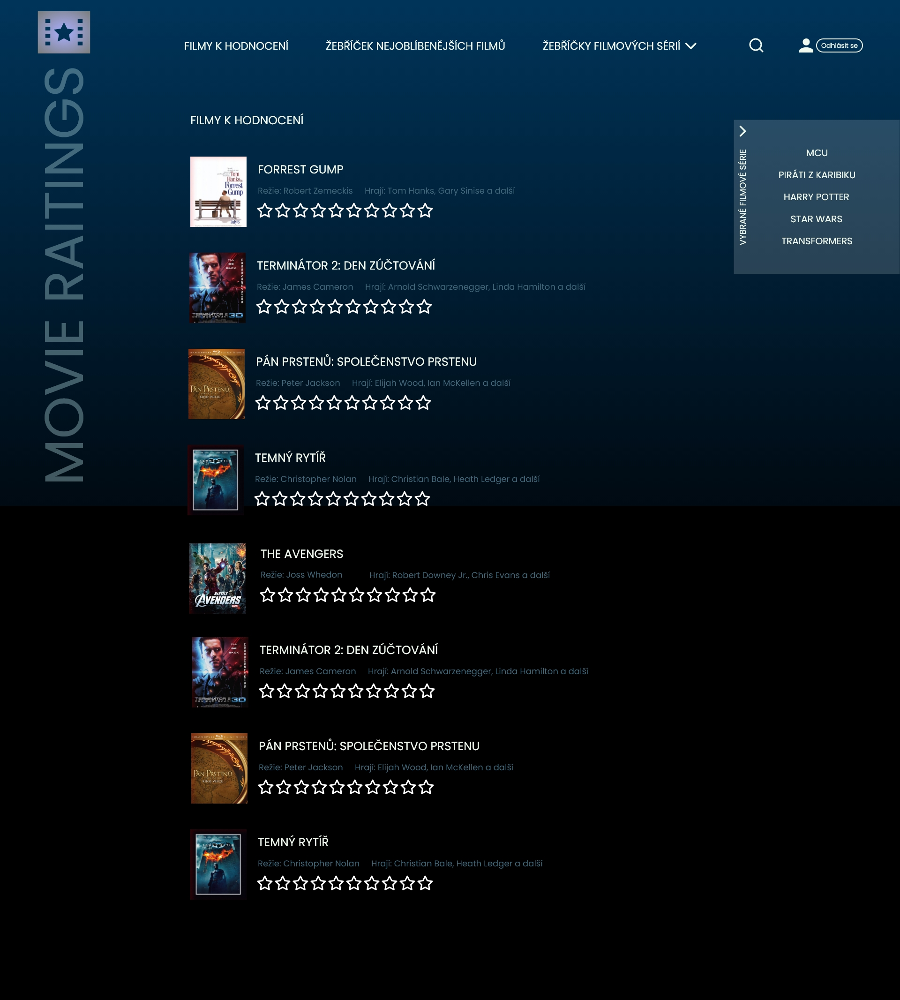
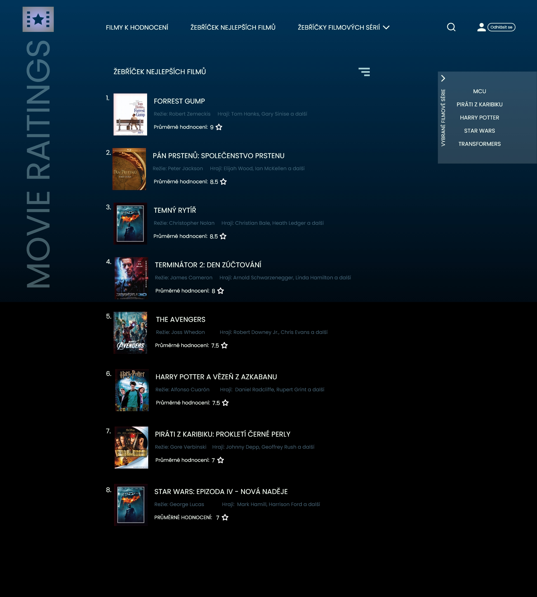
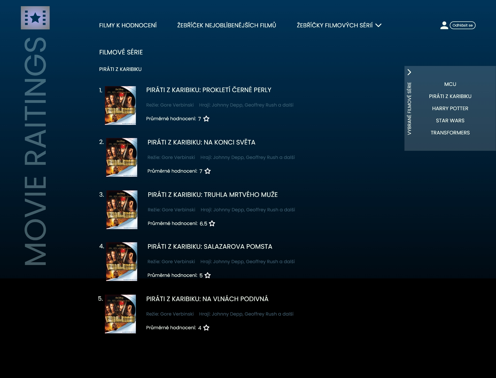
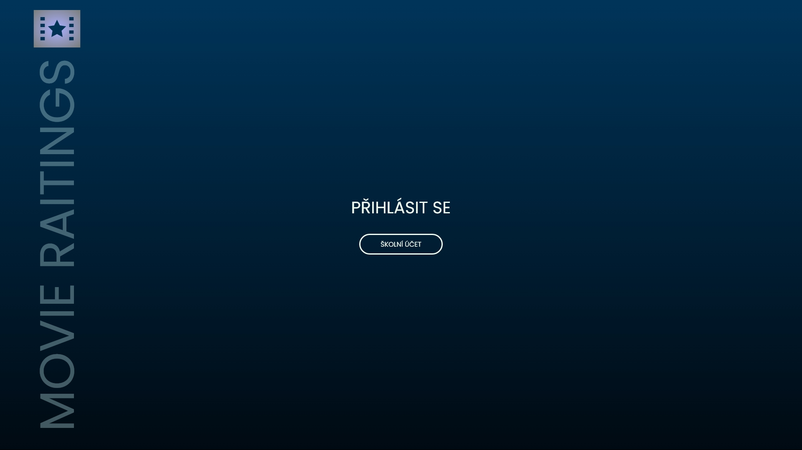
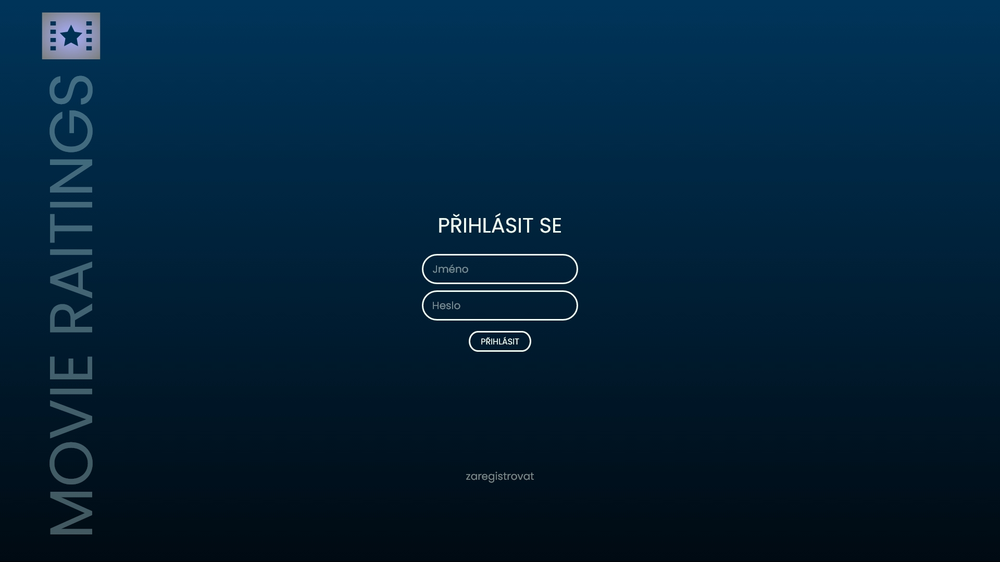
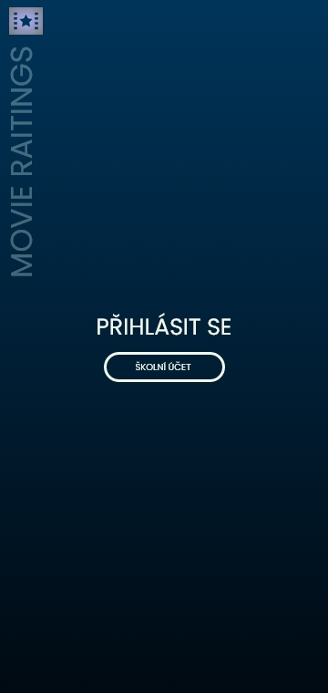
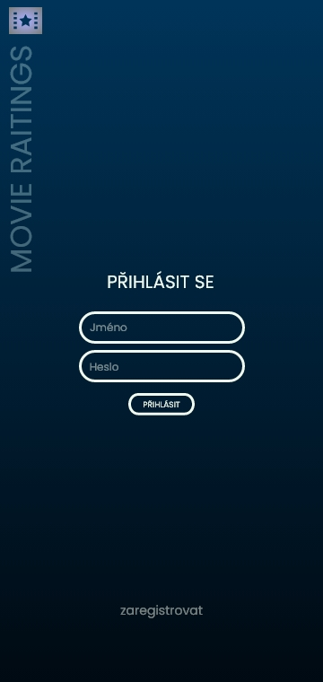
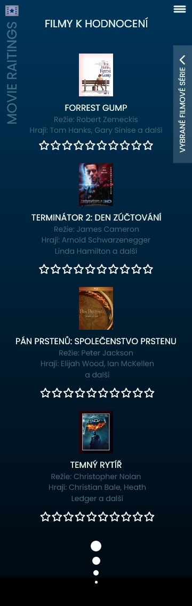
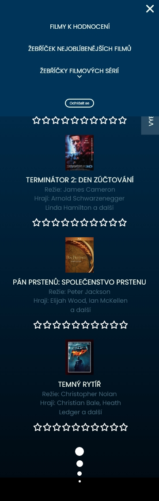

# MOVIE RATINGS

## O aplikaci

Tato aplikace se bude zabývat hodnocením filmů. V aplikaci by měli především hodnotit pouze studenti SPŠSE. Tato aplikace by znázorňovala oblíbenost filmů a filmových sérií mezi studenty. Aplikace bude obsahovat více žebříčků, jeden hlavní se všemi vybranými filmy, další pouze s filmy jedné filmové série apod. V aplikaci se nebudou objevovat všechny filmy, pouze některé vybrané. 

## Princip aplikace

Princip této webové aplikace je jednoduchý. Jednalo by se tedy o stránku, na které by si každý student mohl zhodnotit filmy podle svého názoru. Na stránce by byl jeden hodnotící žebříček, ve kterém by se nacházely vybrané filmy. V tomto žebříčku by se jednotilvé filmy hodnotily hvězdičkami 1-10. Data z tohoto žebříčku by se následně u každého filmu načítala a celkové hodnocení (počet hvězdiček) by se průměroval počtem uživatelů, kteří film hodnotili (počet hodnocení). Na základě těchto údajů by se automaticky vytvářel žebříček nejlépe hodnocených filmů. Dále by bylo možné vybrat z předurčených dalších menších žebříčků, týkajících se jedné filmové série. V této sérii by se řadili podle hodnocení pouze předurčené filmy.

## Rozložení stránek

- hlavní stránkou je stránka *Filmy k hodnocení*
- další stránkou je *Žebříček nejoblíbenějších filmů* obsahující seznam všech filmů seřazený podle hodnocení
- poslední stránkou je *Žebříčky filmových sérií* jenž obsahuje odkazy na různé specifické žebříčky týkající se pouze jedné filmové série např. Harryho Pottera

## Design aplikace

Apliace je designována do tmavého pozadí s kontrastními barvami pro písmo. V pozadí je použit gradient přecházející z černé #000000 až do tmavě modré #003459. Písmo je světlé barvy #F1FAEE. Zbylé prvky jsou v barvách modrozelené - #A5CCD1, #42697C.
- černá `#000000`
- tmavě modrá `#003459`
- modro-zelená světlá `#A5CCD1`
- modro-zelená tmavá `#42697C`

- Návrh celé aplikace je vytvořen jak pro mobilní tak pro desktopové zobrazení.

### Font

- na celé stránce je použit font [Poppins](https://fonts.google.com/specimen/Poppins)
- názvy filmů mají velikost `25px` pro desktop a `16px` pro telefon
- barva: `#F1FAEE`
- navigační prvky mají velikost `22px` pro desktop `14px` pro telefon
- textové prvky (režie, hrají) mají velikost `18px` pro desktop `14px` pro telefon

### Menu

- není fixní
- při mobilním zobrazení se menu mění na hamburger menu a je rozbalovací
- obsahuje navigaci na stránky Filmy k Hodnocení, Žebříček nejlepších filmů, Žebříčky filmových sérií, tlačítko odhlášení a vyhledávání
- druhé postraní menu je fixní `position: fixed;`, při kliknutí vyjede a zajede
- slouží k navigaci na žebříčky filmových sérií

## Princip hodnocení

Každý film v hodnotícím seznamu bude obsahovat obrázek pro znázornění (nejčastěji plakát), jméno filmu, jméno režiséra a dvou herců. Pod těmito informacemi se bude nacházet 10 hvězdiček, určených k hodnocení filmů (1 - nejhorší, 10 - nejlepší). Když by uživatel chtěl dát filmu hodnocení 9, kliknul by na devátou hvězdičku zprava. Tím by se všech devět hvězdiček zabarvilo do žluta a film by byl považován jako ohodnocený. Hodnocení by bylo možné kdykoliv změnit kliknutím na jinou hvězdičku.
Jak již bylo zmíněno, tak ze všech hodnocení se budou vypočítávat průměrná hodnocení filmů. Ta se budou propisovat do *žebříčku nejoblíbenějších filmů*, ve kterém se budou filmy řadit podle hodnocení. A to od nejvyššího (nejlepšího - 10) po nejnižší (nejhorší - 0/1). Filmy v žebříčku bude možné nastavit také obráceně (od nejhoršího po nejlepší) a to pomocí tlačítka v pravé části obrazovky.

## Rozložení stránek

- hlavní stránkou je stránka *Filmy k hodnocení*
- další stránkou je *Žebříček nejoblíbenějších filmů* obsahující seznam všech filmů, seřazený podle hodnocení
- poslední stránkou je *Žebříčky filmových sérií* jenž obsahuje odkazy na různé specifické žebříčky, týkající se pouze jedné filmové série např. Harryho Pottera

### Filmy k hodnocení

- stránka s filmy, kde dochází k hodnocení filmů
- filmy jsou náhodně seřazeny
- možnost vyhledání filmu

### Žebříček nejoblíbenějších filmů

- ohodnocené filmy, které jsou seřazeny od nejlépe hodnoceného
- možnost vyhledání filmu

### Filmové série 

- vybraná série a porovnání jednotlivých filmů

### Přihlašovací stránka 

- odkaz na přihlášení přes školní účet
- alternativní možnost při nepropojení se školním účtem (vytvoření účtu)

## Mobilní design 

- aplikace by měla být funkční i na mobilních telefonech 
- návrhy některých mobilních zobrazení

 
 

##

Aplikace by mohla být malým zpestřením pro studenty. Vhodná na doporučování filmů nebo také na zjišťování trendů a oblíbených filmů mezi studenty.